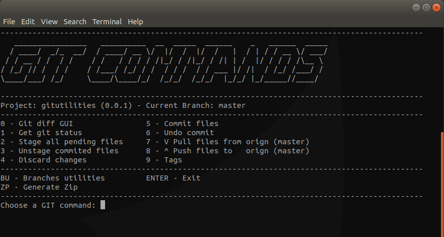

# gitutilities

> Git Utilities GUI on Terminal.

THE PROJECT IS BETA - DONT USE IN PRODUCTION !!!



## Getting Started

Install this globally and you'll have access to the gitutilities on the command line:

### Linux/macOS
```shell
sudo npm install -g gitutilities
```

### Windows
```shell
npm install -g gitutilities
```

## Usage

> In terminal goto root project (package.json folder)

```shell
gitu
```
